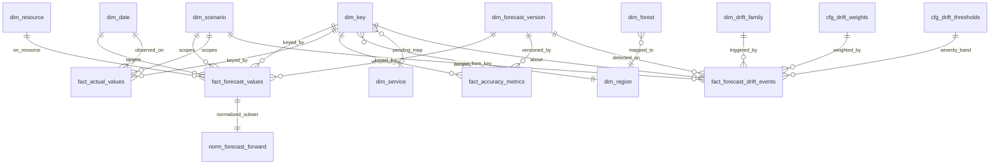
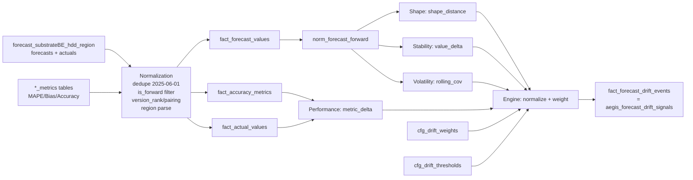

# E2 — Forecast Drift Information Model

**Feature 6986096 — AEGIS Forecast Drift Framework**
**Stage:** E2 — Forecast Drift Information Model (logical design only)
**Date:** 2026-07-12
**Basis:** Only evidence validated in E1A/E1B + Blueprint V2 + Prototype. **No** productive SQL, **no** Power BI, **no** Grafana, **no** data mutation, **no** advance to E3.

> Governance: Microsoft internal / confidential. Logical model only. Server host / connection strings not reproduced. Object names retained because they are required to design the model.

---

## 1. Purpose

Define the canonical information model that all four Forecast Drift families read from. The model is a **star schema** (dimensions + facts + config) plus a **normalization layer** that is the explicit boundary between **source** fields and **derived** fields. It resolves every E1 gap (G1–G7) at the design level so E3 can write formulas against a stable structure.

Full entity attributes are in `E2_entity_catalog.csv`; relationships in `E2_relationship_matrix.csv`; per-family contracts in `E2_drift_family_input_matrix.csv`; end-to-end lineage in `E2_lineage_map.md`.

---

## 2. Layered architecture

```
SOURCE (read-only)              NORMALIZATION                LOGICAL MODEL              DERIVED                 OUTPUT
forecast_substrateBE_hdd_region  dedupe FV 2025-06-01        dim_* / fact_*             horizon_days            fact_forecast_drift_events
  (forecasts + actuals)          forward filter (is_forward) fact_forecast_values       value_delta             (= aegis_forecast_drift_signals)
*_metrics (region/forest/ssd)    version_rank + pairing      fact_actual_values         shape_distance
                                 region parse from Key       fact_accuracy_metrics      rolling_cov
                                                             dims + cfg                 metric_delta -> scores
```

The **normalization layer** (`norm_forecast_forward`, version ranking, region parsing) is where G1/G6 are enforced. Nothing downstream sees raw duplicates or post-hoc frozen values.

---

## 3. Entities (summary — full detail in `E2_entity_catalog.csv`)

**Dimensions**
- `dim_forecast_version` — the version axis; carries `version_rank` + `prev_version_sk` for consecutive-version pairing; flags `is_duplicate_load`.
- `dim_date` — calendar for target dates and metric windows; `month_start` supports version-vs-target logic.
- `dim_scenario` — Enterprise / Consumer / Basilisk; `in_mvp_scope`.
- `dim_key` — forecast key at region grain (52 in source, 45 governed); holds derived `region_code` + FK to `dim_service`.
- `dim_resource` — HDD today; other resources are separate source tables (deferred).
- `dim_region` — **derived** from `Key` prefix.
- `dim_forest` — forest-level namespace (155 keys, `APCP…`) from forest metrics; maps to region.
- `dim_service` — **PENDING**: no source column; must be mapped from `Key` or an external dimension (G3).
- `dim_drift_family` — Performance / Shape / Stability / Volatility + default weights.

**Facts**
- `fact_forecast_values` — forecast points; grain `Key × DateTime × ForecastVersion × Scenario × Resource`; **exactly one `model_version` per cell** (validated).
- `fact_actual_values` — observed values (`ModelVersion='actual'`, `Value>0`).
- `fact_accuracy_metrics` — official upstream metrics (MAPE/MAE/RMSE/Bias/Bias_Pct/SMAPE/Accuracy) per `Key × Forecast_Version × window`.
- `fact_forecast_drift_events` — **the output**; each row = one Forecast Drift Event (the Blueprint `aegis_forecast_drift_signals`).

**Normalization / Config**
- `norm_forecast_forward` — deduped, forward-only forecast base (intermediate).
- `cfg_drift_thresholds` — severity bands (0-20/20-40/40-70/70+).
- `cfg_drift_weights` — family weights (20/40/30/10 initial).

**Naming note / justification:** names follow the user's proposed convention (standard star schema). Two additions, justified: (1) `norm_forecast_forward` as an explicit normalization entity so the source/derived boundary is a first-class object (not hidden in a query); (2) `dim_drift_family` promoted to a dimension so weights/labels are governed data, not hard-coded. `model_version` is modeled as an **attribute** of `fact_forecast_values` (not a dimension) because drift compares version-to-version regardless of which model produced each value.

---

## 4. Canonical grain per drift family

| Family | Canonical grain | Primary source |
| --- | --- | --- |
| **Performance** | `Key × Forecast_Version` (metric window) | `fact_accuracy_metrics` (or recompute) |
| **Shape** | `Key × Scenario × version-pair` (forward horizon curve) | `norm_forecast_forward` |
| **Stability** | `Key × target_date × version-pair` (fixed future target) | `norm_forecast_forward` |
| **Volatility** | `Key × target_date × version-window(N)` (rolling) | `norm_forecast_forward` |
| **Drift Event** | `Key × Scenario × forecast_version(detected_on) × drift_type` | engine (4 sub-scores + cfg) |

Full contracts (inputs, windows, eligibility, derived fields, outputs, limitations) in `E2_drift_family_input_matrix.csv`.

---

## 5. Explicit resolution of E1 gaps

| Gap | Design resolution |
| --- | --- |
| **G1 duplicate FV 2025-06-01** | Normalization layer applies `DISTINCT` on the natural grain; `dim_forecast_version.is_duplicate_load` flags it; `norm_forecast_forward` is deduped before any drift calc. |
| **G6 forward-only** | `is_forward = (target_date >= forecast_version_date)`; `norm_forecast_forward` keeps only forward rows, so shape/stability/volatility never see post-target frozen values. |
| **Version pairing** | `dim_forecast_version.version_rank` (ordered per key/scenario) + `prev_version_sk`; drift joins `v_n` to `v_(n-1)`. |
| **G4 region vs forest grain** | MVP = **region grain** (`dim_key` + `dim_region`). `dim_forest` modeled but deferred; feeds only a future forest-grain Performance variant. |
| **G3 no Service column** | `dim_service` is a first-class but **PENDING** dimension with FK from `dim_key`; populated later by a mapping (stakeholder/E4). Drift does not depend on it for MVP. |
| **G5 scenario scope** | Recommended MVP = **Enterprise** (primary), Consumer secondary; **Basilisk excluded** (single version → no drift). `dim_scenario.in_mvp_scope`. |
| **G2 metrics only 3 versions** | Performance Drift supports two modes: (a) official metrics (shallow, 3 points) or (b) **recompute** MAPE/Bias/Accuracy from `fact_forecast_values` + `fact_actual_values` for depth. Mode is a decision deferred to E3. |
| **Source vs derived** | `E2_entity_catalog.csv.lineage_layer` marks each column `source`/`derived`; `norm_*` is the boundary; all `*_drift_score` fields are derived. |

---

## 6. Logical model diagram (Mermaid ER)



## 7. Flow — source to drift event (Mermaid)



---

## 8. Handoff to E3 (what E2 hands over)

- Stable entities, grain, keys and relationships for all four families + the event.
- Explicit derived-field list (`horizon_days`, `is_forward`, `value_delta[/pct]`, `shape_distance`, `rolling_cov`, `metric_delta`) with the grain each is computed at.
- Gap resolutions encoded as design rules (dedupe, forward-only, pairing, scope).
- Open decisions for E3 (formulas, normalization to 0-100, distance metric, N, Performance mode) — see `E2_open_decisions.md`.

E2 defines **structure and language**; E3 defines **mathematics**. No formula is fixed here.
